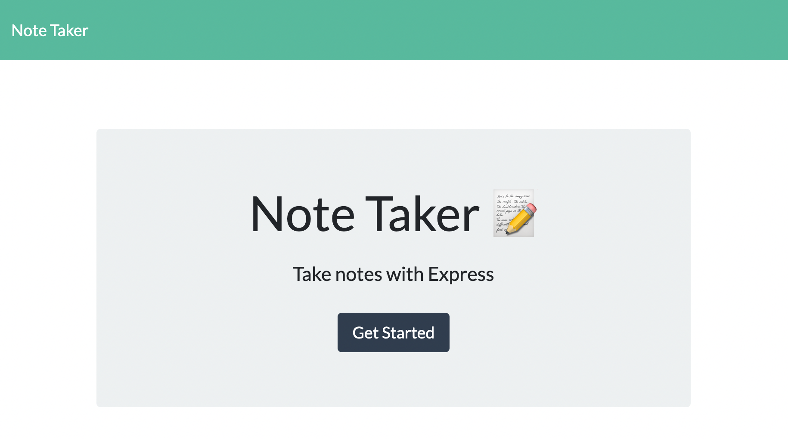
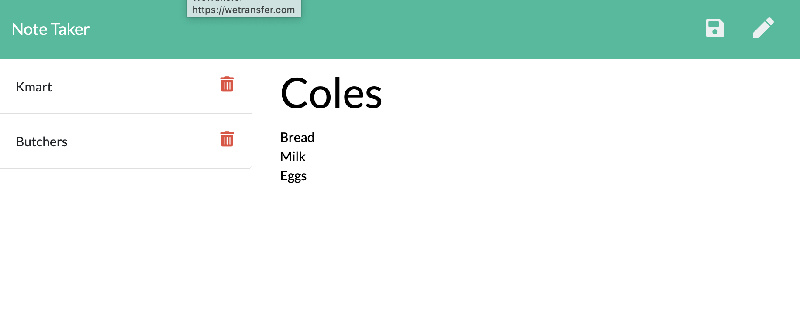

# note-taker
Application that can be used to write and save notes. Bonus feature completed to delete notes using unique id assigned.

You can click [Here](https://obscure-cove-73558.herokuapp.com/) to open the deployed application

## Screenshots
---
The following images show the web application's appearance and functionality: 

## Tools & Technologies
---
    * Front end code was provided which included the HTML pages, and accompanying files of js and css.  Bootstrap and JQuery were utilised in these files.  
    * Backend files were created utilising Express and Node.js.
    * A unique id was required for the database file so I used Get Date to produce a unique number that could then be used as an associated id.
    * The id then enabled me to use the delete button that was available.  

## Installation
---
You can view the project on [Heroku](https://obscure-cove-73558.herokuapp.com/) or alternatively on my github repo (link below).  
To do this you will need to clone repository, open the server file in integrated terminal and enter 'npm i' to install dependancies.  From there you can run 'node server.js' in terminal before opening localhost:8080 in your browser.  

## Questions?
---
  If you have any questions about this project, please contact me directly on [email](mailto:catormerod@gmail.com). You can view more of my projects at [Github](https://github.com/catormerod) or this specific project at [Note Taker](https://github.com/CatOrmerod/note-taker). 
